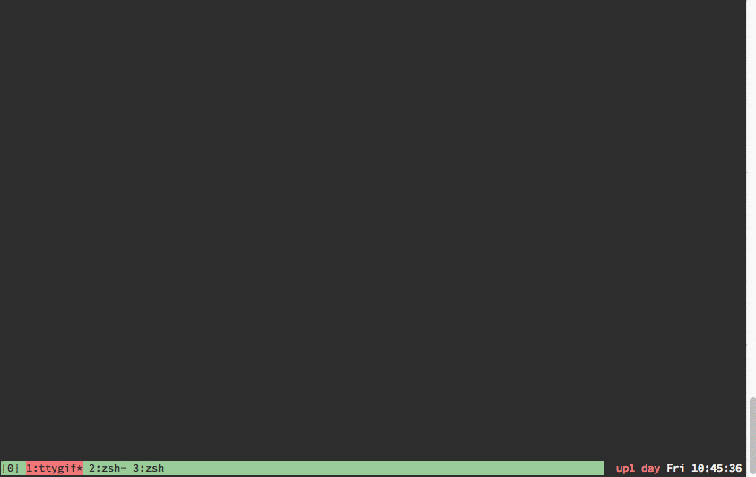

# cuke2jade
Cucumber.js json formatted output to [jade](http://jade-lang.com).


## Installation and Usage



## Install

```sh
$ npm install -g cuke2jade
```

## Usage

```sh
$ cat cucumber.json | cuke2jade # You have jade output
$ npm install -g jade
$ cat cucumber.json | cuke2jade | jade > index.html # You have a html file!
```

### Customising

#### No Stylesheet

`--no-bootstrap`

```sh
$ cat cucumber.json | cuke2jade --no-bootstrap # no stylesheet
```

#### Custom CSS

`--css something.css` Single css file included
`--css a.css,b.css` Comma delimited 


```sh
$ cat cucumber.json | cuke2jade --no-bootstrap --css custom-bootstrap.css # custom css with no defaults
$ cat cucumber.json | cuke2jade --css bootstrap-override.css # custom css overriding bootstrap.css
```
